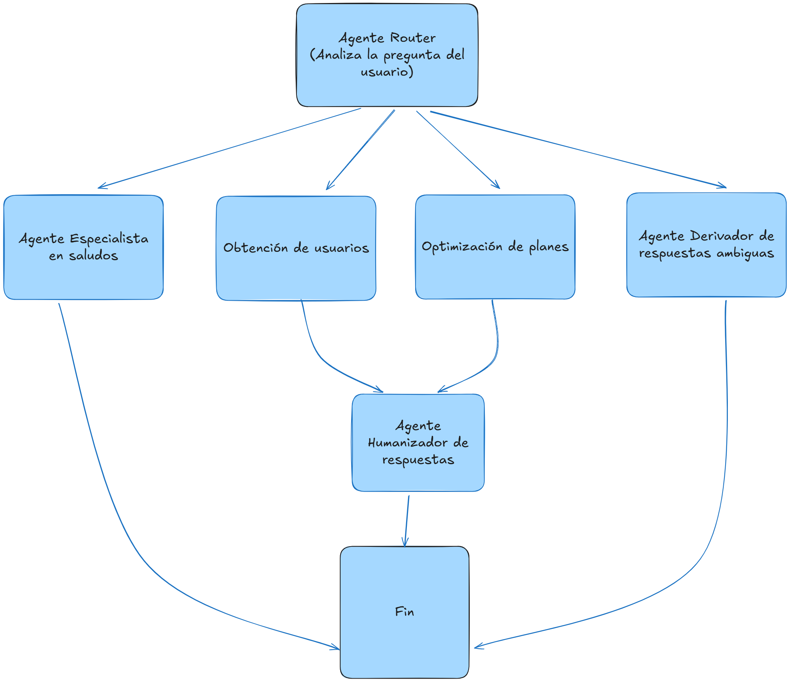
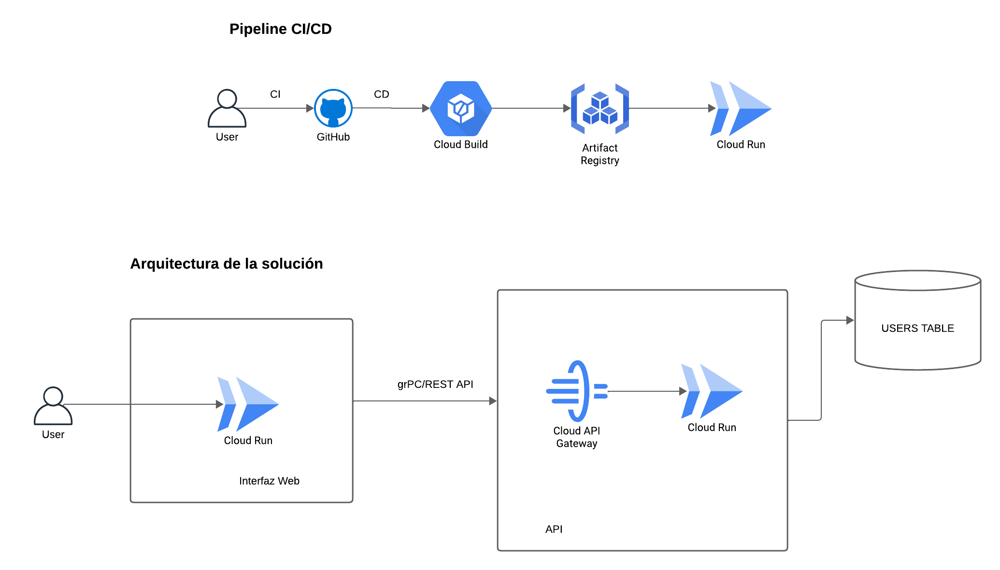
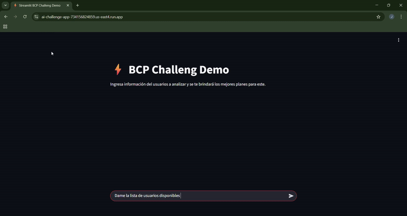
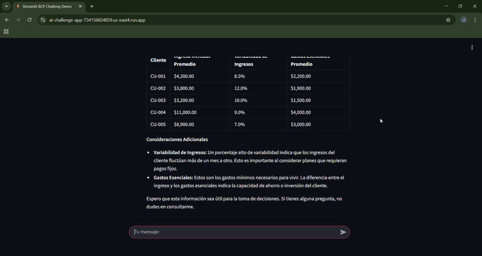
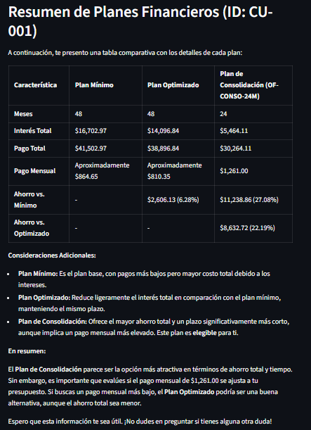
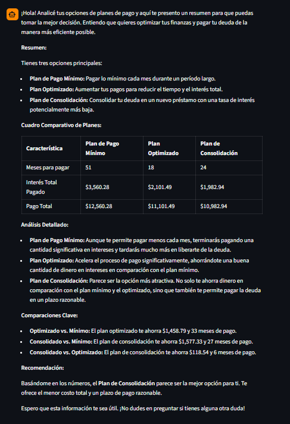

## BCP Challenge - AI Developer

- Stack usado:
    - Cloud: GCP
    - Lenguaje de programación: python
    - Frameworks: LangGraph, Streamlit, Django


## Consideraciones técnicas

Antes de abordar la solución del problema se han considera las siguientes situaciones:

    1. La información brindada del usuario ya se encuentra disponible en alguna base de datos de la compañía, ya que si se cargase la información como un csv, se tendría que subir esa información a un bucket para tener cierta trazabilidad y enviar a url firmada de ese archivo al agente orquestador, colocar la lógica de obtenerción de información mediante un multipart incrementaría la complejidad y no permitiría que sea escalable la solución

    2. Si se brindase un csv con una lista de usuarios el proceso sería asíncrono y sería parte de un workflow de procesamiento, para la solución se ha considerado la situación más práctica y simple, que permita tener una respuesta del agente en el menor tiempo posible.

    3. Para dar una sensación de baja latencia, el agente orquestador responde de manera streaming,  via chunks, de esta manera la interfaz va renderizando lo que devuelve el orquestador.

    4. La obtención de la información crediticia del usuario así como la optimización de los planes se expondrán via api, y será usadas como tool del agente, esto permitiría que otros agentes puedan reutilizar esta lógica.

## Diagrama Agentic
Se está considerando el siguiente diagrama agéntico:



**Nodos**:
- *Agente Router*
    En este nodo se tiene un agente router el cual esta especializado en analizar el tipo de pregunta y determinar a qué nodo posterior del flujo de debe de avanzar

- *Agente especialista en Saludos*
    En este nodo se tiene un agente en saludar amablemente al usuario

- *Obtención de usuarios*
    Nodo que facilita al asesor o usuario conocer a los usuarios disponibles, se va a retornar respuestas limitas y información no sensible del usuario.

- *Optimización de deudas*
    En base a la información crediticia del usuario y a determinadas reglas determiníticas se retorna la mejor manera de refinanciar la deuda, reorganizarla o usar alguna oferta del banco.

- *Agente Derivador de respuestas ambiguas*
    En este nodo se tiene un agente router el cual esta especializado en analizar el tipo de pregunta y determinar a qué nodo posterior del flujo de debe de avanzar


## Diagrama de Arquitectura

Se presenta el diagrama de arquitecuta de la solución así como del pipeline de CI/CD para el despliegue en GCP




## Lista de Endpoints

- GET /api/financial-restructuring/users/
    
    Obtiene la información de todos los usuarios de la empresa de manera paginada
    
    Response: 

    ```json
        
        [
            {
                "customer_id": "CU-001",
                "monthly_income_avg": 4200.0,
                "income_variability_pct": 8.5,
                "essential_expenses_avg": 2200.0
            },
            {
                "customer_id": "CU-002",
                "monthly_income_avg": 3800.0,
                "income_variability_pct": 12.0,
                "essential_expenses_avg": 1900.0
            }
    ]

    ```

- GET /api/financial-restructuring/user/<:user_id>/

    Obtiene la información crediticia de un usuario

    ```json
    {
            "customer_id": "CU-001",
            "monthly_income_avg": 4200.0,
            "income_variability_pct": 8.5,
            "essential_expenses_avg": 2200.0,
            "loans": [
                {
                    "product_type": "personal",
                    "principal": 22000.0,
                    "annual_rate_pct": 26.5,
                    "remaining_term_months": 48,
                    "days_past_due": 0
                }
            ],
            "cards": [
                {
                    "balance": 2800.0,
                    "annual_rate_pct": 42.5,
                    "min_payment_pct": 4.5,
                    "payment_due_day": 12,
                    "days_past_due": 0
                }
            ],
            "payment_histories": [
                {
                    "product_type": "card",
                    "date": "2024-09-10",
                    "amount": 180.0
                },
                {
                    "product_type": "loan",
                    "date": "2024-09-15",
                    "amount": 620.0
                }
            ],
            "credit_score_history": [
                {
                    "date": "2024-08-01",
                    "credit_score": 715
                },
                {
                    "date": "2024-09-01",
                    "credit_score": 725
                }
            ]
    }
    ```

- POST /api/financial-restructuring/optimizer/

    Se calcula de manera determinística, mediante algunas fórmulas matemáticas, el plan óptimo para el usuario en base a su información crediticia y sus deudas.

    Request:

    ```json
        {
            "customer_id": "CU-001",
            "monthly_income_avg": 4200.0,
            "income_variability_pct": 8.5,
            "essential_expenses_avg": 2200.0,
            "loans": [
                {
                    "product_type": "personal",
                    "principal": 22000.0,
                    "annual_rate_pct": 26.5,
                    "remaining_term_months": 48,
                    "days_past_due": 0
                }
            ],
            "cards": [
                {
                    "balance": 2800.0,
                    "annual_rate_pct": 42.5,
                    "min_payment_pct": 4.5,
                    "payment_due_day": 12,
                    "days_past_due": 0
                }
            ],
            "payment_histories": [
                {
                    "product_type": "card",
                    "date": "2024-09-10",
                    "amount": 180.0
                },
                {
                    "product_type": "loan",
                    "date": "2024-09-15",
                    "amount": 620.0
                }
            ],
            "credit_score_history": [
                {
                    "date": "2024-08-01",
                    "credit_score": 715
                },
                {
                    "date": "2024-09-01",
                    "credit_score": 725
                }
            ]
        }
    ```

    Response: 

    ```json
        {
        "customer_id": "CU-001",
        "minimum_payment_plan": {
            "months": 48,
            "total_interest": 16702.972693090964,
            "total_payment": 41502.97269309097
        },
        "optimized_plan": {
            "months": 48,
            "total_interest": 14096.83774615735,
            "total_payment": 38896.83774615735
        },
        "consolidation_plan": {
            "eligible": true,
            "offer_id": "OF-CONSO-24M",
            "months": 24,
            "monthly_payment": 1261.0047108605552,
            "total_interest": 5464.113060653326,
            "total_payment": 30264.113060653326
        },
        "comparisons": {
            "optimized_vs_minimum": {
                "months_diff": 0,
                "absolute_savings": 2606.13,
                "percent_savings": 6.28
            },
            "consolidated_vs_minimum": {
                "months_diff": 24,
                "absolute_savings": 11238.86,
                "percent_savings": 27.08
            },
            "consolidated_vs_optimized": {
                "months_diff": 24,
                "absolute_savings": 8632.72,
                "percent_savings": 22.19
            }
        }
    }
    ```

- POST /api/financial-restructuring/agent/

    Permite interactuar con el agente orquestar y devolver un plan óptimo en base a la información del cliente

    Request:

    ```json
        {
            "question": "Quisiera optimizar el plan financiero de este cliente  CU-001"
        }
    ```

    Response:

    ```json
        {
        "response": {
            "response": "¡Entendido! Aquí te presento un resumen de la información que me proporcionaste sobre el plan financiero del cliente CU-001, junto con un cuadro comparativo para que sea más fácil de visualizar:\n\n**Resumen:**\n\nEl cliente CU-001 tiene un plan financiero con tres escenarios diferentes:\n\n*   **Mínimo:** No se especifican valores ni ahorros.\n*   **Optimizado:** No se especifican valores ni ahorros.\n*   **Consolidado:** No se especifican valores ni ahorros.\n\nParece que la información está incompleta, ya que no hay datos concretos sobre los valores o ahorros asociados a cada escenario.\n\n**Cuadro Comparativo:**\n\n| Escenario    | Valor | Ahorro |\n| :----------- | :---- | :----- |\n| Mínimo       | 0.0   | 0.0    |\n| Optimizado   | 0.0   | 0.0    |\n| Consolidado  | 0.0   | 0.0    |\n\nEspero que esto te sea útil. Si tienes más información o necesitas algo más, ¡no dudes en preguntar!"
        }
    }
    
    ```

- POST /api/financial-restructuring/streaming/agent/

    Permite interactuar con el agente orquestar y devolver un plan óptimo en base a la información del cliente de manera streaming

## Demo

Se presenta una interfaz web que permite interactuar con el agente orquestador en base a la pregunta, así, para el caso de obtener la lista de usuarios se tendría lo siguiente:



Si se desea brindarle un mejor plan al usuario en base a su historial crediticio y las deudas que posee se puede realizar la pregunta de la siguiente manera:



## Apps Desplegadas
Los siguientes enlaces estarán disponibles durante 1 semana, se ha utilizado determinados recursos propios y data sintética para fines de la prueba

- **Backend**: https://api-ai-challenge-734156824859.us-east4.run.app
- **Fronted**: https://ai-challenge-app-734156824859.us-east4.run.app


## Informe de los usuarios 
Si se desea conocer el estado financiero se puede invocar al api que se mencioné lineas arriba, de esa manera se sabrá que información se tiene por usuario
- CU-001
 


- CU-002


- CU-003

